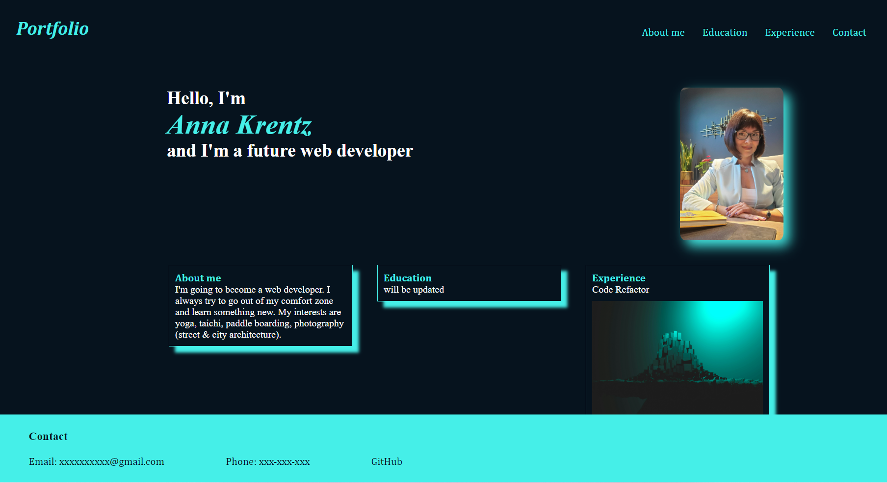

# AnnaK-portfolio

## Description

* My motivation was to practice HTML and CSS skills and to build a deployed web portfolio with work sample. 
* I built this project accoridng with the specified criteria.
* I learned the following:

1. How too apply CSS variables, flexbox, add links.
2. Box styling, responsive design.

## Installation

Non-applicable.

## Usage

To review "AnnaK portfolio", you can click in the deployed link and the screenshot link.

## Deployed link

[deployed link]()

## Screenshots

## Credits

I followed the following tutorials:

https://www.webfx.com/blog/web-design/howto-image-placeholders/

https://www.quora.com/Can-we-build-a-complete-responsive-website-using-css-media-queries

https://kinsta.com/blog/responsive-web-design/#how-to-make-your-website-responsive

https://forum.freecodecamp.org/t/nav-bar-with-link-to-section-in-same-page/501465

